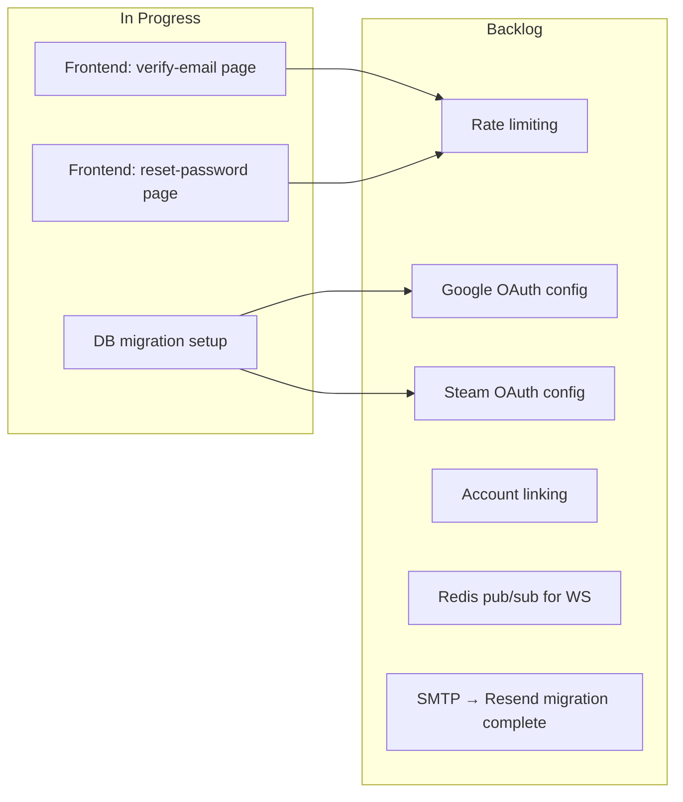
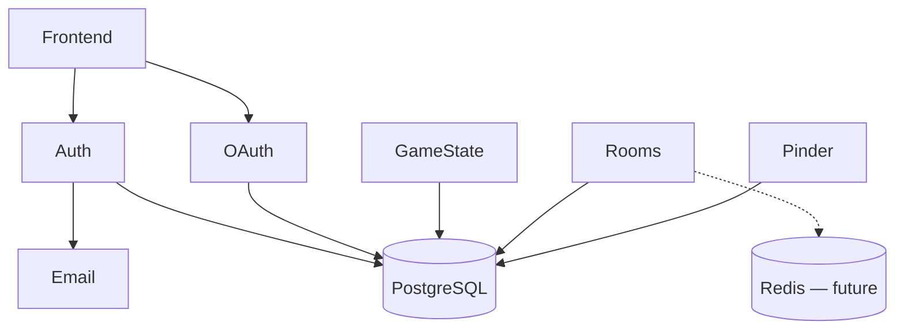

# Orchestration — EigenCore

## Current Sprint: MVP Completion

```mermaid
graph LR
    subgraph "In Progress"
        A[Frontend: verify-email page]
        B[Frontend: reset-password page]
        C[DB migration setup]
    end
    subgraph "Backlog"
        D[Rate limiting]
        E[Google OAuth config]
        F[Steam OAuth config]
        G[Account linking]
        H[Redis pub/sub for WS]
        I[SMTP → Resend migration complete]
    end
    A --> D
    B --> D
    C --> E
    C --> F
```

## Component Dependencies

```mermaid
graph TD
    Frontend --> Auth
    Frontend --> OAuth
    Auth --> Email
    Auth --> DB[(PostgreSQL)]
    OAuth --> DB
    GameState --> DB
    Rooms --> DB
    Pinder --> DB
    Rooms -.-> Redis[(Redis — future)]
```
