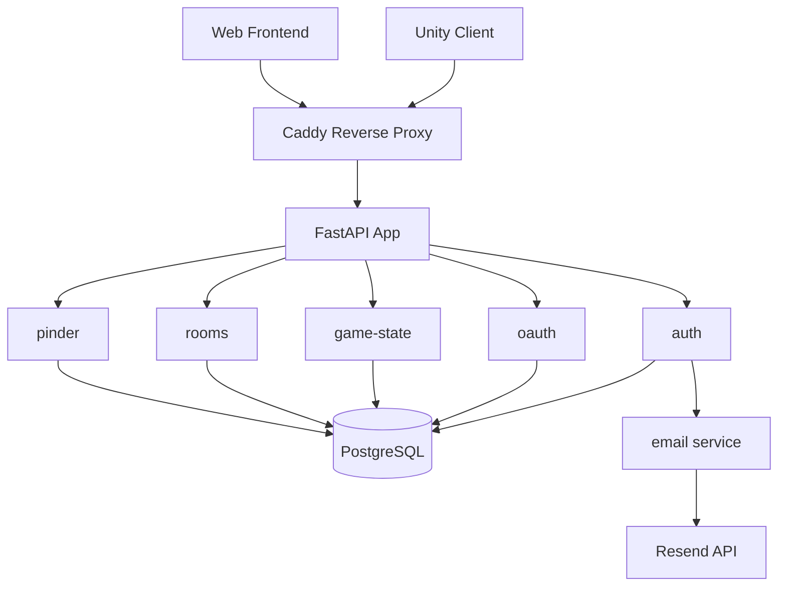

# Architecture

## Overview

EigenCore is a game backend API for indie games. It provides user authentication (email/password + OAuth), game state persistence, multiplayer matchmaking, and the Pinder dating-game API. Built with FastAPI (async Python), PostgreSQL, and deployed via Docker + Caddy.

## Components

| Component | Maturity | Description |
|-----------|----------|-------------|
| auth | prototype | Email/password registration, login, JWT tokens, email verification, password reset |
| oauth | prototype | Discord, Google, Steam OAuth flows |
| game-state | prototype | CRUD for per-user game state blobs |
| rooms | prototype | Room-based matchmaking with WebSocket sync |
| pinder | prototype | Dating game API (profiles, swipes, matches, chat) |
| email | poc | Email verification & password reset via Resend API |
| frontend | poc | Web login/register UI (dark gaming theme) |
| infra | prototype | Docker, Caddy, CI/CD, deployment configs |

## Component Map



## Stack

- **Language:** Python 3.12
- **Framework:** FastAPI (async)
- **Database:** PostgreSQL + asyncpg
- **Auth:** JWT (stateless) + OAuth2
- **Deployment:** Docker (multi-stage) + Caddy (auto-HTTPS)
- **CI:** GitHub Actions

## Key Decisions

- JWT over sessions — stateless, works well with Unity clients
- FastAPI over Flask — async, auto OpenAPI docs
- Caddy over nginx — auto-HTTPS, simpler config
- OAuth-first UX — less password fatigue for gamers
- bcrypt pinned <5.0.0 (v5.x breaks passlib)

## Code Layout

```
app/
├── main.py              # FastAPI app, CORS, lifespan
├── api/
│   ├── deps.py          # Dependency injection (get_current_user, get_db)
│   └── routes/
│       ├── auth.py      # Register, login, verify-email, password reset
│       ├── oauth.py     # Discord, Google, Steam OAuth
│       ├── game_state.py # CRUD game saves
│       ├── rooms.py     # Matchmaking + WebSocket
│       └── pinder.py    # Dating game API
├── core/
│   ├── config.py        # Settings (env vars)
│   ├── security.py      # JWT encode/decode, password hashing
│   ├── email.py         # Resend email templates
│   └── email_service.py # Email sending logic
├── models/              # SQLAlchemy models (User, GameState, Room)
├── schemas/             # Pydantic schemas
└── db/
    └── database.py      # Async engine + session factory
```
